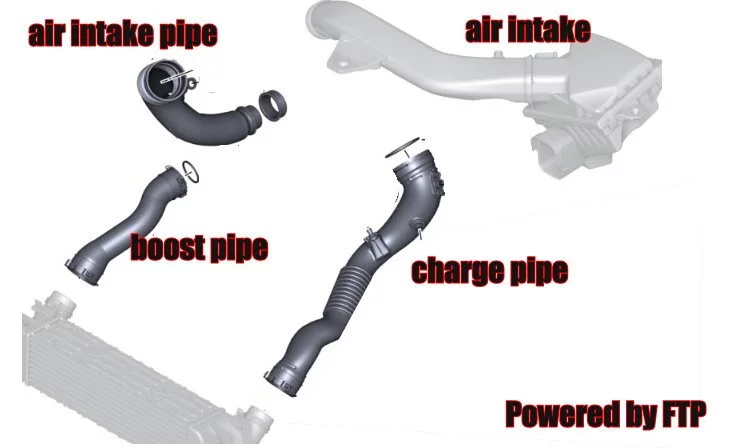

# OG F87 mods

## List of mods done

Cosmetic / Aesthetic mods

- Gloss black grille surrounds (IND F87 M2 Front Grille Surround Set SKU: `IND-F87-FGS`). The way it should be OOTB.

Performance, reliability (preventative) mods

- FTP Motorsport charge pipe
- FTP Motorsport boost pipe
- FTP Motorsport intake pipe (turbo inlet pipe)
- Turner Motorsport [F87 M2 Oil Catch Can Kit](https://www.turnermotorsport.com/p-588375-f87-m2-catch-can-kit/)
- Turner Titanium Magnetic Oil Drain Plug (M12x1.5) [Review](https://f87.bimmerpost.com/forums/showthread.php?t=1830240) by [@F87Source](https://f87.bimmerpost.com/forums/member.php?u=396529)
- bootmod3 stage 1 (MultiMap Stage 1 using Map 3: Octane 93 - 98 RON)

Diagram

## List of mods to be done

- Turner Titanium Magnetic DCT Oil Drain Plug (M24x1.5)
- Turner Titanium Magnetic Differential Drain Plug (M22x1.5)
- FMIC - Front Mounted Intercooler. CSF 8115 High Performance Intercooler, VRSF Competition HD or Wagner Competition EVO1.
- [ECS Tuning Aluminum Coolant Hose Flange Kit](https://www.ecstuning.com/b-ecs-parts/ecs-performance-coolant-outlet-hose-kit/004503la01/). Reviewed by [@F87Source](https://f87.bimmerpost.com/forums/showthread.php?t=1773412).
- ~~Rein Aluminum Coolant Hose (AKA Micky Mouse) Flange: [Rein CHC0609](https://www.fcpeuro.com/products/bmw-aluminum-coolant-hose-flange-rein-chc0609). [Review by @F87Source](https://f87.bimmerpost.com/forums/showthread.php?t=1773412)~~
- Coolant return hose (buy additional backup replacement)
- [Malo Industries](https://www.maloindustries.com/products/n54-and-n55-crank-seal-protection-plate-1) Crank Seal Protection Kit. [Review by @F87Source for N55](https://f87.bimmerpost.com/forums/showthread.php?t=1807187)
